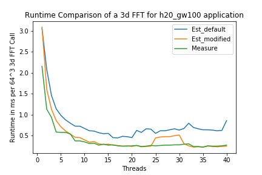
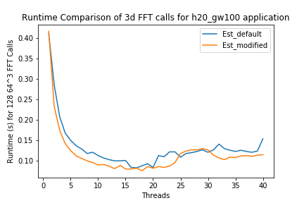

# FFTW Plans and Wisdom

FFTW planning is part of the `fft3d_s` function call in CP2K and adds additional delay to the 3d FFT execution.

## Setting Different Plans

These can be set in the global section of the application, for example

```
&GLOBAL
  RUN_TYPE     ENERGY
  PROJECT      ALL_ELEC
  FFTW_PLAN_TYPE PATIENT
  ...
&END GLOBAL
```

- The default plan used is the ESTIMATE, which uses a simple heuristic, therefore adds the lowest delay.

- Executing the plans once creates a wisdom file that can be reused to execute 3d ffts in the same hardware as it was created. The wisdom is created in the path given by the `FFTW_WISDOM_FILE_NAME` parameter in the Global section of the application's input file. Repeated executions with the same path use the plan created.

## CP2K and Plans

The 3d FFT calls from CP2K to the FFTW makes use of the default function calls to create a 3d plan and for 3d execution. These are decided in the `fftw3_create_plan_3d` function in `fftw3_lib.F`.

For single process multithreaded executions, CP2K chooses between using the default 3d execution or decomposes the 3d FFT into 1d executions. The latter is chosen for:

- Any configuration with ESTIMATE plan.
- Single threaded execution with 3d FFT >= 256$`^3`$

```FORTRAN
  IF ( (fftw3_is_mkl_wrapper()) .OR. &
       (.NOT. plan_style == 1 ) .OR. &
       (n1 < 256 .AND. n2 < 256 .AND. n3 < 256 .AND. nt== 1)) THEN
    ! If the plan type is MEASURE, PATIENT and EXHAUSTIVE or
    ! the grid size is small (and we are single-threaded) then 
    ! FFTW3 does a better job than handmade optimization
    ! so plan a single 3D FFT which will execute using all the threads

    plan%separated_plans = .FALSE.
!$  CALL XFFTW_PLAN_WITH_NTHREADS(nt)

    IF ( plan%fft_in_place) THEN
      CALL XFFTW_PLAN_DFT_3D(plan%fftw_plan,n1,n2,n3,zin,zin,fft_direction,fftw_plan_type)
    ELSE
      CALL XFFTW_PLAN_DFT_3D(plan%fftw_plan,n1,n2,n3,zin,zout,fft_direction,fftw_plan_type)
    ENDIF
  ELSE
    ALLOCATE(tmp(n1*n2*n3))
    ... Manual plan...

```

### Function Call Hierarchy

The hierarchy shown below is not of the directories rather the function calls:

```
+- fft_wrap_pw1pw2 (pw_methods.F)
  +- fft3d_s (fft_tools.F)    // time `fft3d_s`
    +- get_fft_scratch (fft_tools.F)
    |  +- fft_create_plan_3d (fft_lib.F)
    |    +- fftw3_create_plan_3d (fftw3_lib.F) <-- Here
    +- fft3d (fft_tools.F)
      ...
```

## Performance Comparison

The table compares the time taken for different plans using the existing CP2K implementation for a 64$`^3`$ 3d FFT.

### Single Process Single Thread

| FFTW Plan Type | fft3d_s (sec) | fft3d_s_execute (sec) |  Speedup of fft3d_s_execution |
|:--------------:|-------------|-----------------------|---------|
| ESTIMATE | 0.406 | 0.387 | 1 |
| MEASURE | 1.522 | 0.279 | 1.38 |
| PATIENT | 53.16 | 0.258 | 1.5 |
| EXHAUSTIVE | 379.726 | 0.271 | 1.42 |

- Reusing the plans gives an overall speedup:

| FFTW Plan Type | fft3d_s (sec) with plan reuse| fft3d_s_execute (sec) |
|:--------------:|-------------|-----------------------|
| PATIENT | 0.273 | 0.258 |

## Modification to Estimate plan execution

Here, we compare the performance of the h20_gw100 application for two different 3d FFT sizes 64$`^3`$ and 128$`^3`$ by forcing the estimate plan of multithreaded CP2K execution to execute the default 3d FFT call that doesn't decompose to 1d FFTs. This is done by the following:

- Modify the condition to include the `ESTIMATE` plan.

```fortran
       (.NOT. plan_style == 0 ) .OR. &
```

- Fine grained timing of the 3d fft as shown below (timeset, timestop).

```fortran

SUBROUTINE fftw33d ( plan, scale, zin, zout, stat )
  ...
  INTEGER                                     :: handle3, handle4
  CHARACTER(len=*), PARAMETER :: routineX = 'fft3d_s_execute'
  CHARACTER(len=*), PARAMETER :: routineY = 'fft3d_omp_execute'
  ...

  IF (.NOT. plan%separated_plans) THEN
  CALL timeset(routineX, handle3)
      CALL XFFTW_EXECUTE_DFT(plan%fftw_plan,zin,xout)
  CALL timestop(handle3)
  ELSE
  CALL timeset(routineY, handle4)
  ! Or use the 3 stage FFT scheme described in fftw3_create_plan_3d
       ALLOCATE(tmp1(n1*n2*n3))   ! Temporary vector used for transpositions
      !$OMP PARALLEL DEFAULT(NONE) PRIVATE(tid,nt,i,j,k) SHARED(zin,tmp1,n1,n2,n3,plan,xout)
      ...
!$    tid = omp_get_thread_num()
!$    nt = omp_get_num_threads()
      CALL fftw3_workshare_execute_dft(plan%fftw_plan_nx, plan%fftw_plan_nx_r, &
                                        n3,nt, tid,&
                                        zin, n1*n2, tmp1, n1*n2))
      ...
  CALL timestop(handle4)
  ```

The graph below compares the performance of the FFT3d execution (doesn't include plans and other overhead) per call with and without the modification by scaling threads from 1 to 40 for the 3d FFT executions.



The minimum time taken amongst all the threads shows the performance of the modified version to be closer to the FFTW isolated performance.

| 3d Size | 3d FFT def (ms) | 3d FFT mod (ms) |
|---------|:---------------:|:---------------:|
| 64 | 0.455 | 0.23 |
| 128 | 5.1 | 2.2 |

The graph below compares the overall 3d FFT function calls (including the planning and other overheads) also shows the similar trend. 



The minimum time among all the threads:

| 3d Size | Overall 3d FFT def (s) | Overall 3d FFT mod (s) | Single 3d FFT Call def (ms) | Single 3d FFT Call mod (ms) |
|---------|:----------------------:|:---------------------:|-----------------------------|-----------------------------|
| 64^3 | 0.083 (for 128 calls)  | 0.076 (for 128 calls) | 0.64 | 0.59 |
| 128^3 | 1.87 (for 249 calls) | 0.9 (for 249 calls) | 7.5 | 3.6 |

The difference of the single 3d FFT time can be seen between the two tables. This overhead could be due to planning and several other factors that needs further investigation.

## Conclusion

| 3d Size | 3d FFT def (ms) | 3d FFT execute def (ms) | 3d FFT mod (ms) | 3d FFT execute mod (ms) | 3d FFT Isolated (ms) |
|---------|:---------------:|:-----------------------:|-----------------|-------------------------|----------------------|
| 64^3 | 0.64 | 0.45 | 0.59 | 0.23 | 0.22 |
| 128^3 | 7.5 | 5.1 | 3.6 | 2.2 | 1.591 |

The modified implementation for the estimate plan gets closest to the isolated FFTW double precision performance.

The difference between the default and modified executations gets larger with 3d FFT sizes.

## Reference

1. Interesting Discussion on Planning with CP2K - [here](https://groups.google.com/forum/#!searchin/cp2k/wisdom|sort:date/cp2k/RxqHE9rxcT8/NZHigakJyiEJ)

2. [CP2K Manual](https://manual.cp2k.org/cp2k-4_1-branch/CP2K_INPUT/GLOBAL.html#FFTW_WISDOM_FILE_NAME)